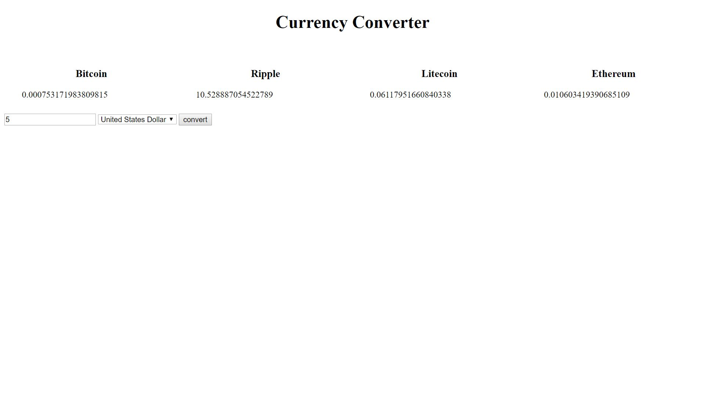

Currency Converter API

This API is here to convert currency into cryptocurrency. You enter the amount of money and what country it's
for and with the push of a button you will know that value in 4 different crypto coins.

Link to project:

How It's Made:
Tech used: HTML, CSS, JavaScript, jQuery, APIS
The first API takes the foreign currency returns the value of the buy price, sell price. This calls on a function that takes this argument and passes it as an parameter to our function that converts our foreign currency into bitcoin value and then to usd cash. Which then calls on another function that takes the usd argument and passes as a parameter to call on our second API that take this usd cash value and converts it into the 4 crypto coins displayed on the DOM.

Lessons Learned:
This project taught me the value of starting small and breaking problems down. In the end I wanted to convert a value into crypto coin but this took a lot of testing and refactoring my app. In the end I convert the value into 4 crypto coins but throughout my testing I was working to get the conversion to work for one coin. It would've taken a lot longer if every line of code involving the conversion I had to change was for four different coins throughout the whole testing process. Instead I got the conversion to work for one crypto coin and I took the same process to add a couple more crypto coins. This will help me greatly in the future to break things down such as the conversion for 1 coin and once I understand them apply them however the project needs which is for 4 coins in this case.
